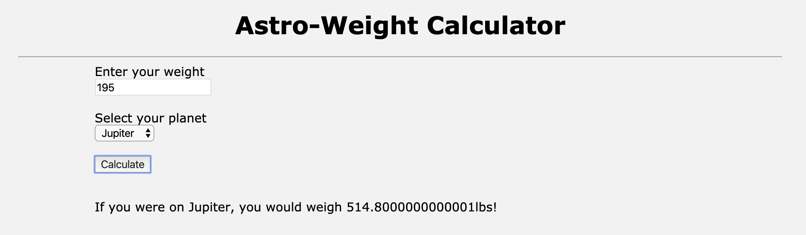

# WEB102-Astro-Weight-Calculator

My very first project in the San Diego Code School coursework. Allows a user to enter their bodyweight, 
select a planet, and use a button to submit their input for a calculation of how much that user would weigh 
on that planet.

Please feel free to demo the project by taking these steps.. 

1. Clone or fork the repo 
2. $ npm install 
3. $ npm start (which will build and run on local server 3000)
4. Open up your browser to view on localhost 3000

Thank you, Miles Mickelson
